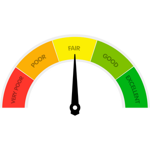

The world of loans can get tricky as the different types of loans start to pile up during your loan search. If you’re applying for a loan, you’ll have to know which loan is right for you and what makes that loan different from other options.

There’s nowhere better to start than the beginning. What is a conventional loan and is it right for you? Read on for the basics and important information about conventional loans.

### What is a Conventional Loan?

A conventional loan doesn’t refer to just a single type of loan, but is an umbrella term that describes a group of different loans that fit certain qualities. At the most basic level, a conventional loan is simply a loan that isn’t insured by the federal government. Conventional loans can be broken into conforming and non-conforming loans, which refers to whether the loan meets the requirements for being sold to Fannie Mae or Freddie Mac.

Non-conforming conventional loans are loans that don’t meet the standards for Freddie Mac or Fannie Mae, which means they’ll be purchased by a different set of investors. Jumbo loans are one type of non-conforming conventional loan.

 

There are different guidelines for different kinds of conventional loans, though on average all conventional loans will have stricter requirements for borrowers than government-backed loans like FHA loans. For example, you’ll often need higher credit scores to qualify for a conventional loan, starting from around 620 minimum.

### What Are the Requirements for a Conventional Loan?

A first-time home buyer can secure a conventional loan with a down payment of 3 percent, but these specifics will depend on certain factors. Some considerations for conventional loan requirements:

- If purchasing a second home, your down payment will be at least 10 percent.
- If you’re purchasing a property that isn’t a single-family home, your down payment may be 15 percent.
- If you aren’t a first-time buyer or don’t earn more than 80 percent of the median income in your area, your down payment will be 5 percent.
- A jumbo loan often requires a down payment of between 20 to 40 percent.
- An adjustable-rate mortgage requires a down payment of 5 percent.

For those who want to refinance, you’ll need more than 3 percent equity. For all cases, borrowers need at least 5% equity. However, a cash-out refinance requires at least 20 percent equity in the home while refinancing with a jumbo loan requires 10.1 to 25 percent equity.

### Private Mortgage Insurance

Lenders require borrowers to carry private mortgage insurance (PIM) to protect them in the event that a borrower defaults on the loan. Those with a down payment of less than 20 percent will be required to carry PIM; the cost varies depending on the type of loan, size of the down payment, and borrower’s credit score.

Some borrowers will pay their PMI as an upfront fee, though it’s usually paid as part of the monthly mortgage payment. You can also choose to pay your PMI in the form of a slightly raised interest rate. Our loan experts can help you determine which option best suits your needs.

Once you reach 20 percent equity in your home, you won’t have to pay for PMI. A new appraisal can also determine a new PMI requirement for you if you reach 20 percent equity due to the home’s value increasing.

### Basic Conventional Loan Requirements

Some of the standard conventional loan requirements you’ll likely encounter are as follows:

- Debt-to-Income Ratio: Your DTI indicates the percentage of your income that goes towards paying debts. Most conventional loans will require your DTI to be no higher than 50 percent.

- Credit Score: For most conventional loans, you’ll be required to hold a credit score of at least 620 to qualify.

- Loan size: Conforming conventional loans must meet certain limits that are set by Freddie Mac and Fannie Mae. Loan limits differ by location and are updated each year.

### What Makes a Conventional Loan Different from Other Loans?

Understanding how conventional loans differ from other types of loans will help you better determine which loan is right for you.

##### Conventional Loans Compared to FHA Loans

Since FHA loans are backed by the government, these loans often have more lenient requirements for qualifying, such as a lower minimum credit score of 580. Though conventional loans do offer a lower down payment of 3 percent versus the FHA loan’s 3.5 percent, they can be challenging to obtain for those who can’t meet the credit score requirement of 620.

Mortgage insurance premiums will differ from the FHA loan to the conventional loan. If you put less than 10 percent down on an FHA loan, you’ll have to pay MIP for the duration of the loan, whereas a conventional loan doesn’t require MIP once you reach 20% equity.

##### Conventional Loans Compared to VA Loans

The major difference between conventional loans and VA loans is the eligibility—only approved veterans, active-duty military, and surviving spouses can qualify for VA loans. Other requirements for a VA loan will be smilier to a conventional loan, though VA loans usually offer additional benefits, such as not requiring a down payment or mortgage insurance.

If you’re eligible for a VA loan and are deciding between the VA loan and a conventional loan, you’ll need to know the following:

- The VA loan requires a funding fee to offset the cost of VA loans for taxpayers, though certain borrowers can qualify for having the funding fee exempted (such as surviving spouses and others). The funding fee ranges from 1.25 percent to 3.3 percent.

- A VA loan can’t be used to purchase a second home and you generally can’t hold two VA loans at one time.

##### Conventional Loans Compared to USDA Loans

The main difference between conventional loans and USDA loans is that the USDA loans can only be used for purchasing rural properties. A USDA loan also comes with income limits, while a conventional loan doesn’t. However, USDA loans don’t require borrowers to carry private mortgage insurance, though they do require a fee of 1 percent of the loan’s total amount.

### What Are the Rates for a Conventional Mortgage?

Since interests rates for conventional mortgages change daily, it’s best to speak to a loan expert about what to expect in terms of your interest rates. Conventional loans generally carry lower interest rates than FHA loans but higher than VA loans.

### How to Qualify for a Conventional Loan

A conventional loan can be a great option for those who meet the general requirements and can manage a down payment of at least 3 percent. Since conventional loans are generally lower cost than other types of loans, this loan may be right for you. Speak with one of our loan experts today to receive personalized guidance on which loan is best for your situation.
