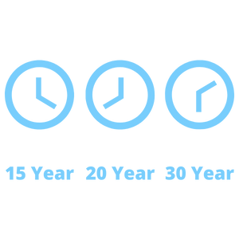

Refinancing can be a great option for many people, but with so many different ways to refinance, it can be confusing and tedious to find the right choice for you. To give you the information you need to know for making an informed decision about your refinance, we’re breaking down the basics about how to refinance with a conventional refinance.

### What is a Conventional Fixed-Rate Refinance?

The term conventional refers to a loan that conforms to the guidelines for the size of the loan and your financial situation. Conventional refinance loans can offer lower interest rates than jumbo refinance loans, VA refinance loans, or VA refinance loans. The terms of conventional loans generally range from 10 to 30 years.

 

A “fixed-rate” refinance refers to the interest rate on your loan and indicates that the rate won’t change for the duration of the loan. Monthly principal payments also remain fixed for the duration of a conventional loan, making it a great option for borrowers planning to stay in their home for at least a few years.

Unlike a fixed-rate refinance, an adjustable-rate mortgage (ARM) refinance loan features a lower monthly principal and interest payment for the first few years of the loan. An ARM can be a better option for those who plan to move from their home within a few years.

##### 15 and 20 Year Fixed-Rate Mortgage

You can pay your home off faster with a 15-year fixed-rate refinance or a 20-year fixed-rate refinance. These options offer a short loan term and lower interest rate, which can help you build equity more quickly. However, your monthly payments will be higher than those of a 30-year loan.

##### 30 Year Fixed-Rate Mortgage

The 30-year fixed-rate refinance loan is a good option for those who want lower monthly payments. While the interest rate is fixed, you will ultimately pay more interest over the duration of the loan than a shorter-term mortgage.

### What Are the Benefits of a Conventional Loan?

If you’re considering a conventional loan, you’ll likely enjoy the benefits these loans offer.

##### The Lowest Fixed Rate

Conventional mortgages often carry lower interest rates and Annual Percentage Rates (APR) than other fixed-rate loan options, making them popular with those seeking lower payments.

##### No Unexpected Interest Rates

One of the major benefits of a fixed-rate mortgage is never having to worry about a change in your payments due to an increase in interest rates. With a fixed-rate mortgage, your interest rates won’t change for the entirety of the loan.

##### Cost to Refinance

The cost to refinance will differ for every person based on their situation. Our loan experts can help you find out exactly what costs you can expect from your refinance and find the best options for you.

##### Lenient Requirements

Conventional mortgages often require less documentation than a government-backed loan, like the VA or FHA loan. Because conventional loans require less documentation during the application process, the overall processing time can be greatly reduced.

### Conventional Loan Qualifications and Requirements

If you’re considering a conventional loan, you’ll need to know the basic requirements and qualifications.

- Borrower Equity: For conventional loans, you’ll likely be required to place at least 5 percent as a down payment. If the borrower equity is less than 20 percent, mortgage insurance may be required, which will increase the overall monthly payment and APR. Government-backed loans like the FHA loan can be a good choice for those in need of lower down payment requirements.

- Credit Score: For a conventional loan, you’ll be required to meet a certain credit score minimum. For those with a high credit score, like 740 or above, conventional loans can be a great option.

- Loan Limit: Loan limits change annually and differ based on property type, such as a single-family unit versus a multi-family unit. However, jumbo loans can allow you to obtain a loan while surpassing the conforming loan limits.

### Conventional Refinance Information

There are plenty of benefits to obtaining a conventional fixed-rate mortgage or refinance, however, there are lots of options for the many different situations and needs people have. If you aren’t sure which option is best for you, speak with one of our loan experts today so you can make the best choice for your situation.
