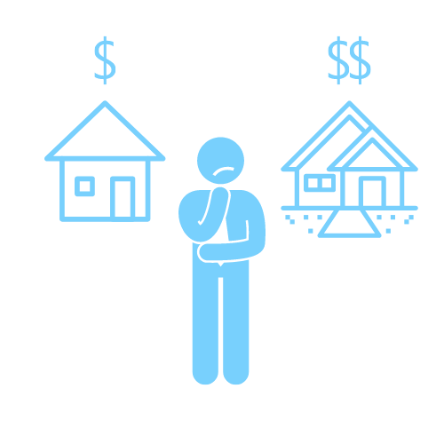

One of those memorable parts of life is the time you buy your first home. However, whether using a conventional loan or a VA loan, the process can get a little confusing.

Don’t let the details overwhelm this important moment in your life. We’ve gathered these tips and information to put your mind at ease about what you’ll need to know when purchasing your first home. Want a little more guidance? Our loan experts are always available to take the uncertainty out of your home purchasing process.

### 1. Decide What You Can Afford When Purchasing Your First Home

The obvious first step when purchasing a home is checking the price tag. Before you can get the ball rolling on purchasing your first home, you’ll need to figure out what your price range is. Don’t forget to consider different factors such as:

- If a down payment is required and what the cost is
- Your annual income
- Any pre-existing debts
- Homeowner’s insurance
- Housing association costs

By taking into consideration as many factors as possible, you’ll have a solid idea for what kind of montage payment is within your range.

### 2. Decide What Type of Loan is Right for You

There might not be a shortage of loans available, but great quality loans are less prevalent. It’s crucial to make sure you get the right loan for your needs while still getting the best benefits available to you. It can be difficult deciding which loan is right for you; our loan specialists are always available to answer your questions.

For those who qualify, the VA loan is well known for its great benefits.

#### What Are the Benefits of a VA Loan?

If you qualify, a VA loan can make a world of difference when purchasing your first home. This loan offers many benefits that can speed up both the timeline for when you can purchase a home as well as the overall process.

A few of these great benefits are noted below.

- **Less Strict Qualifications**: Credit can be a major obstacle to getting a good loan with an affordable interest rate. The VA loan makes this process much easier; since these loans are government-backed, it’s easier for buyers to qualify and receive good rates.

- **Lower Monthly Payments**: A VA loan can save you a lot of money. These loans don’t require buyers to carry private mortgage insurance (PMI), meaning you get to keep a significant portion of money compared to loans that require PMI.

- **No Down Payment Required**: We’ve saved the best for last—VA loans don’t require down payments. While conventional loans can require 5 percent down and FHA loans often require 3.5 percent down, a VA loan allows buyers to purchase their home with $0 down, speeding up your timeline for purchasing a house significantly.

#### Getting Pre-Approved

If you’re in the process of purchasing a home, you’ll need to get pre-approved before securing your loan. During this pre-qualification process, a loan officer assesses the homebuyer's financial situation as well as what they qualify for. After this, the homebuyer submits a completed loan application to the lender for approval.

We’re available to answer your questions and help you get started with the pre-approval process.

#### Finding a Real Estate Agent

Next up on your to-do list when purchasing your first home is finding a real estate agent. If you’re using a VA loan to purchase your home, you’ll want to find a real estate agent with experience in helping active duty military members and veterans get the most out of the VA Benefits Program.

We can help you get started on your home purchasing journey as well as offer reputable recommendations for real estate agents to help make purchasing your first home the happy memory it should be.
