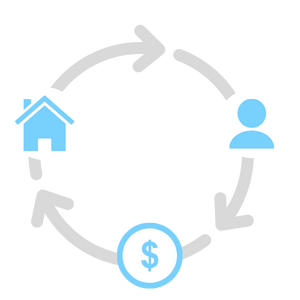

If you’re in the process of planning to apply for a loan, you’ll likely have encountered many different kinds of loans, including government-backed loans like the FHA loan. Many people prefer obtaining an FHA loan if possible because of the more flexible requirements it offers. It’s possible to qualify for an FHA loan even with a lower credit score or debt.

Read on for the latest information you need to know when considering an FHA loan.

 

### FHA Loan Basics

As the name suggests, the FHA loan is backed by the Federal Housing Administration. Since these loans are insured by the FHA, your lender is protected against any loss in the event you default on the loan, which enables these loans to have more flexible requirements for borrowers.

With an FHA loan, you can qualify with lower credit scores and obtain a low down payment. However, these loans require borrowers to carry mortgage insurance. You don’t have to be a first-time homebuyer to qualify for his loan, although low down payments make this a good option for first-time buyers.

The FHA loan offers a few notable benefits:

- Lenders can accept lower down payments.
- Bankruptcy and other financial issues don’t immediately disqualify you.
- Closing costs can be included within the loan.
- Credit score requirements are lower than other loans.

### What Are the Requirements for an FHA Loan?

If an FHA loan sounds like a good deal for you, there are several requirements you’ll need to meet to obtain this loan. Some of the standard requirements for an FHA loan are as follows:

- The home you purchase must be a primary residence, not a vacation home or investment property.
- The home you purchase must be appraised by an FHA-approved appraiser.
- An inspection must be completed to ensure the property meets the minimum standards.
- You must live on the property within 60 days of closing.

These are the basic requirements you’ll need to consider when applying for an FHA loan. However, there are more specific requirements that concern loan limits and income requirements. We’ll cover the details of obtaining an FHA loan next.

##### About FHA Mortgage Insurance

Unless you make a down payment of 10% at minimum, you’ll be required to carry mortgage insurance for the entirety of your FHA loan. Paying a mortgage insurance premium (MIP) ensures lenders against any loss if you default on the loan.

Your mortgage insurance will be assessed first by charging an upfront MIP, which is usually 1.75% of your base loan total. Additionally, FHA loan borrowers are required to pay an annual MIP based on the length of the mortgage, your down payment, your total mortgage amount, and your loan-to-value ratio. An average annual MIP payment is generally 0.45 percent to 1.05 percent of the base loan total.

##### About FHA Loan Down Payments

If you’re familiar with down payments, you know that this payment is a portion of the purchase price of a home that’s paid upfront. When it comes to an FHA loan, the minimum down payment you can make will be tied to your credit score.

FHA loans require a minimum of 3.5 percent as a down payment for credit scores of 580 and above. However, if you make a down payment of 10 percent, a credit score between 500 to 579 is accepted.

##### About FHA Loans and Credit Scores

A credit score is the number between 300 to 85 that indicates your creditworthiness. The way your credit score is determined depends on a multitude of factors, such as:

- How often you use credit
- Timeliness in bill payment
- Amount owed on credit cards
- The type of credit you have (loans, credit cards, etc.)

A higher credit score will allow you to qualify for an FHA loan even with a higher debt-to-income ratio (DTI). The percentage of your monthly gross income that is applied to paying debts is your DTI; that’s your monthly debt payments divided by your monthly gross income. A lower DTI is more favorable when applying for loans, but can be offset y a higher credit score.

The FHA considers 31 percent to be the limit of what your monthly mortgage payment should take up from your monthly gross income. If your loan is being manually underwritten, your DTI should remain at or below 43 percent of your monthly gross income.

##### About FHA Interest Rates

No one enjoys paying interest, but FHA interest rates can make the sting a little less painful. Since FHA loans are backed by the government, lenders can offer lower interest rates compared to conventional loans. Your interest rate will depend on a variety of factors such as income, credit score, the current interest rates, your down payment amount, and others.

##### About FHA Loan Limits

There are limits to how much you can borrow with an FHA loan and these limits are set based on county property values. Loan limits can range from a high limit of roughly $800,000 to a lower limit of $350,000, depending on the location. However, loan limits will differ if the property contains multiple units.

##### About FHA Income Requirements

While your FHA loan eligibility isn’t entirely dependent on your income, you will be required to prove a steady employment history and your income must be verifiable. Documents like pay stubs, federal tax returns, and W-2s can be used to prove your income, though your lender may request further examples for verification.

### What are the Different Kinds of FHA Home Loans?

When searching for the right loan, it’s important to make sure the limits that different loans entail will suit your needs. There are a few different types of FHA loans and each come with their own limits for the type of home you can purchase and restrictions on how the money you receive can be spent.

Reviewing the different FHA loan classifications can help you decide which loan is right for you.

 

##### The FHA Rate/Term Refinance

The FHA rate/term refinance is a great option for those who want lower rates but are limited by lower credit scores. Because of its flexible credit requirements, you can lower your rate or change your term even with a credit score average of 580, as long as you have a low DTI. However, you can bring more debt into the transaction if you have a credit score of 620 or higher.

You may be required to pay MIP for the total duration of the loan depending on the amount of equity you carry into the rate/term refinance, however.

##### The FHA Purchase

If you have a credit score of roughly 580, you’ll be able to purchase a home with as low as 3.5 percent down. However, with a credit score of 620 and above, you can possibly qualify even with a higher DTI, though your DTI can never reach above 57 percent in any event.

##### Cash-Out Refinance

A cash-out refinance can be completed with an FHA loan. Generally, you’ll be required to hold a minimum average credit score of 620 for the cash-out refinance. To convert your property value into cash, you’ll also need a minimum of 15 percent equity in your home.

For a cash-out refinance, you’ll need full documentation, such as employment verification plus income and asset sharing.

##### The FHA Streamline

For those with an existing FHA loan, the FHA Streamline offers special perks when doing a rate/term refinance. Even if you owe more on your home than it’s worth, this loan option may allow you to refinance into a lower. You may also be able to gain a lower mortgage insurance rate, as the rate for FHA Streamlines is 0.55 percent of your overall loan total annually and the upfront MIP is 0.01 percent.

FHA Streamlines are a popular choice because of the ease of obtaining them. Since this option doesn’t require extensive documentation, you may qualify for reduced appraisal requirements, limited employment verification, and even less documentation for income and assets.

While this option is attractive for its ease and benefits, there are still requirements you’ll have to meet, such as:

- Make six payments on your current loan before obtaining a Streamline.
- 210 days past your first payment on the current loan.
- Have no 30-day late payments in the past 6 months on your current loan.
- No more than one 30-day late payment on your loan in the past year.

##### The FHA 203(k) Loan

If you want to make renovations on your home, this loan enables you to both buy and make renovations on your home all with a single loan. Some restrictions for this option are the minimum loan balance of $5,000 and the 6-month window for completing repairs or renovations.

There are two varieties of this loan, the standard and limited. A standard loan will give you more leniency for repairing your home while the limited loan required less paperwork for getting approved.

You might consider the FHA 203(k) loan for projects like:

- Adding updated systems like central air or an automatic garage opener.
- Making repairs or changes to the house’s foundation.
- Replacing old flooring.
- Replacing or adding gutters, plumbing, or roofing.

### Should You Get an FHA Loan?

If you’re unsure whether an FHA loan or a conventional loan is better for your needs, there are a few crucial differences that can help you decide. The fundamental difference between an FHA loan and a conventional loan is that the FHA loan is backed by the government, while the conventional loan is offered through Freddie Mac or Fannie Mae. A conventional loan will often have more strict requirements for approval, which means you’ll likely need a higher credit score and lower DTI.

However, for both a conventional loan and an FHA loan, you’ll need to plan for additional expenses after obtaining your loan. Consider the expense of closing costs, which are often dependent on the home’s price and the type of mortgage, but generally range from 3% to 6% of a home’s value. Additionally, you’ll want to budget for unexpected repairs after purchase, particularly when purchasing an older home.

Finding the right loan for your needs can be overwhelming, especially considering the right decision can save you headaches and money. To get expert guidance on what loan is best for your situation, reach out to us today and we’ll get you started in the direction of your goals.
